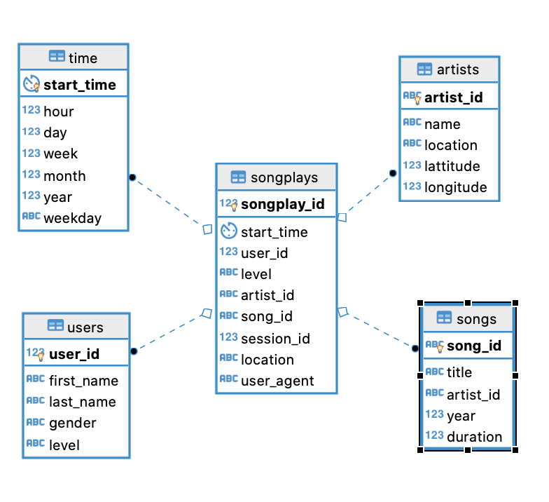

# Relational Postgres DB for Sparkify App

## Project Scope

### The Project is about Building a data model for Sparkify Analysis Team since it's hard for an analyst to query from JSON files I will build for them a Postgres DB and ETL Pipeline to process and load all the files into the desired DB using the skills I learned from Udacity Data Engineering ND course

# Data Source 
we have two dataset as following:

* Song Dataset
The first dataset is a subset of real data from the Million Song Dataset. Each file is in JSON format and contains metadata about a song and the artist of that song. The files are partitioned by the first three letters of each song's track ID. For example, here are filepaths to two files in this dataset.

* Log Dataset
The second dataset consists of log files in JSON format generated by this event simulator based on the songs in the dataset above. These simulate activity logs from a music streaming app based on specified configurations.

# DB schema Design 

The schema used for the project is star schema consists of one fact table songplays 
and four dimension tables users ,songs ,artists ,time

# Files Description 
1. data: datasets of songs and logs Folder
2. create_tables.py: Python script to build The database 
3. sql_queries.py: Python script containing all  Creation and insertion SQL statements
4. etl.py: Python script to extract ,Transform and load data in the targeted source 

# Project Requirements 

* PostgreSQL DB
* Jupyter Notebook or any IDE 

Python Packages 
* psycopg2
* ipython-sql
* pandas
* os
* glob

# Execution Steps 
1. Setup environment 

2. Run create_tables.py script to Build the Database 

3. Run etl.py script to start the ETL pipeline service

4. Test the output by using test.ipynb file (remember to close the connection after performing the testing )
 

